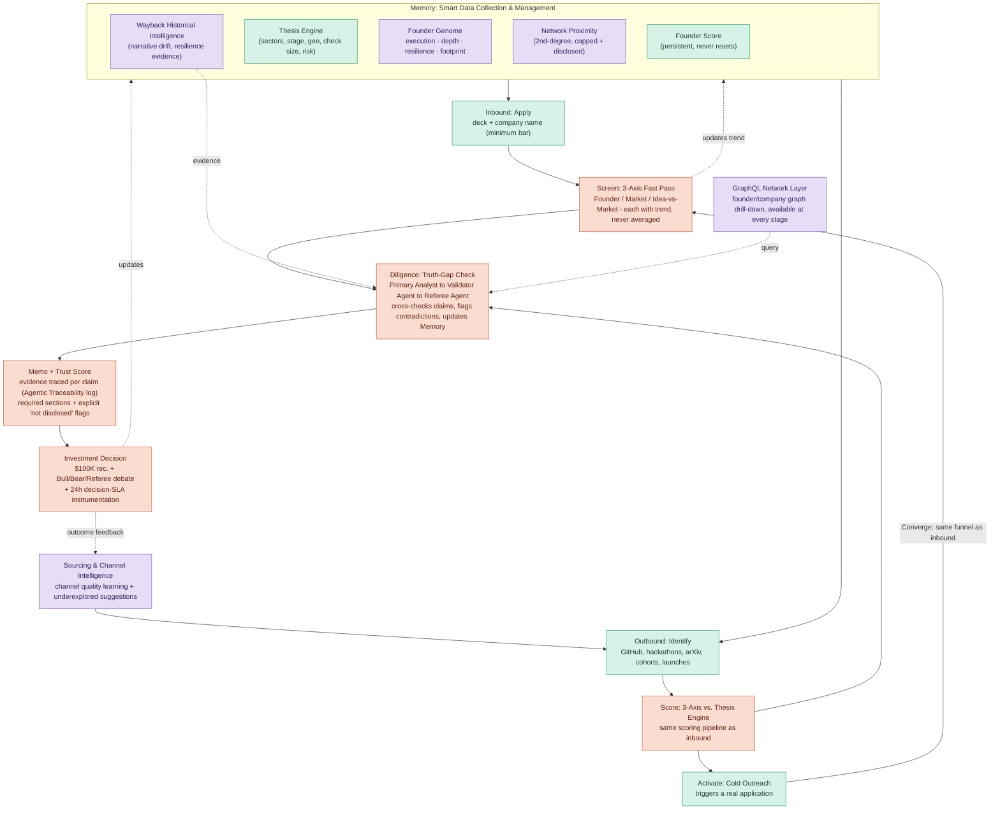

# VC Brain — Product Requirements Document (PRD)

**Challenge:** The VC Brain: Deploying $100K Checks in 24 Hours
**Sponsor:** Maschmeyer Group, in collaboration with MIT Club of Northern California and MIT Club of Germany
**Event:** 6th Global AI Hackathon (Hack-Nation)
**Version:** v1.0 (Elaborated Hackathon PRD)
**Owner:** Team VC Brain
**Date:** 2026-07-18

> **For parallel agent builds:** this PRD is split into per-workstream files under `docs/` — start with `docs/13-PRE-BUILD-CHECKLIST.md`, then `docs/00-OVERVIEW.md` and `docs/01-CONTRACTS.md`, then your assigned workstream file (02–12). Pre-build references: `14-SEED-DATA-SPEC`, `15-MOCK-FIXTURES`, `16-MIGRATIONS-GUIDE`, `17-PARALLEL-WORKFLOW`. This master document remains the authoritative source if any conflict arises.


## 1. Motivation and Vision **[BRIEF]**

Founders capable of building the next transformative company are frequently invisible until they happen to know the right person. Their evidence of capability — pitch decks, GitHub repositories, half-built product pages, hackathon results, social posts — is scattered and unread. Diligence is slow, and capital allocation today follows *networks*, not *merit*. By the time a fund sees a strong founder clearly, many equally strong founders have already given up.

**The fix must work in both directions:**
- Some founders are *spotted* — a GitHub commit streak, a hackathon win, a paper worth a phone call.
- Others *apply* directly — a student, a first-time founder, an engineer with zero VC connections.

In both cases, the same outcome must be possible: **within 24 hours, the founder knows whether they have $100K to build**, and that decision is driven by *what the system already knows about them* — a persistent, ever-sharpening profile of skill, experience, and track record: the **Founder Score**, a credit score for founders. The Founder Score is not narrative flavor — the system must actually compute and use it as one input into every investment decision.

**Ambitious goal:** Build a data- and AI-first operating system that transforms venture capital — discovering exceptional founders, deploying capital at 100x speed, and supporting the next generation of AI entrepreneurs — by identifying and tracking potential founders/teams and deploying $100K checks within 24 hours.

**North Star (out of scope for build, but frames the architecture):** An autonomous venture fund spanning the full lifecycle, with one human in the loop for oversight, not execution. This challenge is scoped to **Sourcing → Screening → Diligence → Decision**. Portfolio monitoring, follow-on, fund ops, and exit are explicitly **out of scope** — no hackathon time should go to UI for those stages.

---

## 2. The Three Pillars **[BRIEF]**

The VC Brain is built on three pillars that together give a single investor the reach and analytical power of an entire investment organization.

### 2.1 Sourcing — "How do you find the best founders?"
- The **single most important part of the MVP**.
- Surfaces the strongest founders *before* they formally begin fundraising.
- Judged on **data richness and smart sourcing ideas, not polish**.
- This is the area with the **least commercial competition today** — our team should go further here than anywhere else in the product.

### 2.2 Assessment & Intelligence — the reasoning layer
- Operates on top of Memory to produce insights, challenge assumptions, and recommend next steps.
- Triggered by an inbound application, **or** by signals crossing a conviction threshold autonomously (outbound).
- Must be transparent about confidence, uncertainty, and the evidence behind every conclusion.

### 2.3 Memory — the data foundation ("nothing discarded")
- Ingests pitch decks, interviews, launches, GitHub activity, and social traction.
- Deduplicates, enriches, timestamps, and tags everything by source.
- Houses the **Founder Score** — persists across applications, never resets.
- Surfaces the **trend over time**, not just the latest snapshot.

These three pillars map directly onto our architecture layers (see §10) and onto the pipeline stages Sourcing → Screening → Diligence → Decision.

### 2.4 End-to-End Pipeline Flow Diagram

The diagram below is our team's canonical pipeline view. It follows the brief's own architecture (Smart Data Collection/Thesis Engine/Founder Score at the top, Inbound/Outbound feeding Screen/Score, Activate converging back into Screening, Diligence updating Memory, Memo+Trust Score, then Decision) and layers in every capability our team has added on top: **Founder Genome** (§11.5) and **network proximity** (§10.4.1) at data collection, **Wayback historical intelligence** (§10.7) feeding both sourcing and diligence, the **Validator/Referee agent loop** (§11.3, §12.2) inside Diligence, **Agentic Traceability logging** (§12.1) inside Memo generation, **Sourcing & Channel Intelligence** (§10.5) feeding Outbound scoring, and the **GraphQL network layer** (§10.6/§17) available at every stage for drill-down.

`Teal` = sourcing & data layer · `Coral` = scoring & decision layer · `Purple` = our added intelligence/trust modules.



**Where this differs from a purely brief-literal pipeline:** the top `Memory` box is not just Founder Score + Thesis Engine — it also carries the Founder Genome, the capped/disclosed network-proximity signal, and Wayback-derived history, so a cold-start founder entering via Inbound or Outbound is never scored off a blank profile. The Validator/Referee loop and Agentic Traceability log sit inside Diligence/Memo exactly where the brief's stretch goals expect them, and the Sourcing & Channel Intelligence feedback loop closes the outer circuit from Decision back to Outbound.

---

## 3. Problem Statement (Team Framing)

Exceptional founders are missed today because:
1. Discovery happens too late — after a founder has already started fundraising through their network.
2. Evidence of capability is fragmented across code, papers, hackathons, social presence, and abandoned or half-built product pages.
3. Diligence is manual, slow, and inconsistent across analysts.
4. Capital access remains network-gated, not merit-gated.
5. First-time, "cold-start" founders — no GitHub history, no funding history, no warm intro — are systematically under-scored by any system that leans on network signals. **The brief explicitly warns: generic ingestion/enrichment will not score highly if it ignores this case.**

VC Brain must make founder potential *visible* and *reasoned about* directly — with the cold-start case treated as a first-class design constraint, not an edge case.

---

## 4. Goals and Non-Goals

### 4.1 Goals
- Build sourcing/ingestion depth that goes further than anywhere else in the product (per brief guidance: sourcing carries the most evaluation weight and the least existing competition).
- Persist a longitudinal **Founder Score** in Memory that never resets and shows trend over time.
- Score every opportunity on **three independent, non-averaged axes**: Founder, Market, Idea-vs-Market — each with its own trend.
- Produce **evidence-backed investment memos** where every claim traces to a source with a **Trust Score** (confidence level), verified externally where possible, with contradictions flagged.
- Support a **configurable Thesis Engine** (sectors, stage, geography, check size, ownership targets, risk appetite) that filters and scores every recommendation.
- Support **compound natural-language queries** (multi-attribute reasoning) in one pass, not five manual filters.
- Deliver **investor-grade UX**: Notion-level approachability, Bloomberg-level analytical depth, usable without technical support.
- Explicitly solve for the **cold-start founder** (no GitHub, no funding, no network) as a named, tested case.
- Produce a defensible recommendation a human investor could act on within **24 hours**, with instrumentation proving the speed.
- **[OUR EDGE]** Add agentic traceability, a validator/self-correction loop, sourcing-graph intelligence with channel learning, a founder/company GraphQL network layer, Wayback-based historical company intelligence, and a lightweight federated/privacy-preserving scoring module.

### 4.2 Non-Goals **[BRIEF]**
- Portfolio monitoring, follow-on decisions, fund operations, or exit modeling — explicitly out of scope; do not spend hackathon time on UI for these.
- A fully autonomous, zero-human-in-the-loop fund (that's the North Star framing, not a deliverable).
- Fabricating confidential data (financials, cap tables) that would not realistically be available — must be flagged as "not disclosed" instead.
- Production-grade blockchain infrastructure — a lightweight, demoable federated/privacy pattern is enough; full decentralization is a time trap.

---

## 5. Target Users
- Solo GP / early-stage VC analyst using this as their entire back office.
- Scout / accelerator operator surfacing candidates into a fund's pipeline.
- The founders themselves — since most hackathon participants are the exact profile this system is built to find, per the brief's framing ("you'll understand better than almost anyone what actually gets noticed").

---

## 6. Core User Stories
- As an investor, I can set my fund's thesis (sector, stage, geography, check size, ownership target, risk appetite) once, and every downstream recommendation is filtered/scored through that lens.
- As an investor, I can see founders discovered **before** they started fundraising, with the exact signal that triggered their discovery.
- As a founder, I can apply with just a deck and company name and get a confident decision within 24 hours.
- As an investor, I can ask a compound natural-language question ("technical founder, Berlin, AI infra, enterprise traction, no prior VC backing, top-tier accelerator") and get ranked, evidence-backed matches in one pass.
- As an investor, I can see three independent scores (Founder / Market / Idea-vs-Market) with trend arrows, never a single averaged number.
- As an investor, I can click any claim in a memo and see the exact deck slide, GitHub commit, tweet, or interview line behind it, plus a Trust Score.
- As an investor, I can see a founder's persistent Founder Score and its history across every application they've ever submitted — before this venture and, if they return, after it.
- As an investor, I can see which sourcing channels have historically produced my best deals, and get suggestions for underexplored channels.
- As an investor, I can explore a founder's or company's network (co-founders, past companies, accelerators, programs) via a graph interface.
- As an investor, I can see a company's historical web presence (including dead sites) to judge narrative consistency over time.
- As an investor, for a cold-start founder with no funding/GitHub history, I can still get a reasoned, evidence-based score built from public footprint signals rather than a network-gated score.

---

## 7. MVP Requirements (Detailed) **[BRIEF §2, items 1–8]**

### 7.1 Thesis Engine **[BRIEF]**
- Investor configures: sectors, stage, geography, check size, ownership targets, risk appetite.
- **Must be configurable, not hardcoded** — a hardcoded single-fund thesis misses the point of this pillar (per brief FAQ #15).
- Every recommendation, ranking, and score is filtered and weighted through the active thesis.
- Store thesis as a versioned object so historical recommendations can be replayed against a new thesis.

**Requirements:**
- CRUD for thesis profiles (a fund could run more than one).
- Thesis directly parameterizes: candidate ranking, watchlist promotion thresholds, memo emphasis, and hard filters via `exclude_sectors[]` / `require_signals[]` (see `12-THESIS-SETTINGS-UI.md`).

**Perplexity-powered thesis research [OUR EDGE]:**
- The active thesis is compiled into structured research queries executed against the **Perplexity API** (search-grounded LLM with citations) to continuously source thesis-matching founders/companies from the live web — e.g., a thesis of "pre-seed AI infra, Berlin, technical founders" generates recurring Perplexity sourcing sweeps for recent launches, hiring posts, hackathon results, and community mentions matching that lens.
- Perplexity results enter the same Bronze ingestion path as every other source (provenance: `source = perplexity`, query text, retrieved citations, timestamp) — they are candidates for the watchlist, not pre-trusted facts.
- Because Perplexity returns **citations natively**, every sourced lead arrives with source URLs already attached — feeding directly into the evidence/Trust layer rather than requiring a separate retrieval pass.
- The same capability is packaged as Cursor skills (`thesis-sourcing-sweep`, `memo-research`) in `.cursor/skills/`, so the memo pipeline and VC Agent Chat reuse identical research logic.

### 7.2 Smart Data Collection & Management **[BRIEF]**
- Actively collect, validate, and structure founder/company data from heterogeneous sources.
- **The data layer matters as much as the intelligence built on top of it** — this is graded as its own axis (30% of evaluation).
- Sources to bring or synthesize (per brief hints): Crunchbase, LinkedIn, GitHub, ProductHunt, Hacker News, arXiv, patents, synthetic founder profiles with **seeded contradictions**, anonymized/fictional pitch decks.
- **Quality of ingestion matters more than dataset size.**

**Requirements:**
- Source-tagged, timestamped, deduplicated ingestion pipeline (see §9, Memory layer).
- At least one class of **seeded contradiction** in test data (e.g., deck claims $500K ARR while public usage signals suggest otherwise) to demonstrate the trust/validator layer actually catches something.
- Explicit low-confidence flagging rather than silent guessing when data is sparse.

### 7.3 Multi-Attribute Reasoning **[BRIEF]**
- Move beyond keyword search.
- Support complex natural-language queries resolved **in one pass**, e.g.: *"technical founder, Berlin, AI infra, enterprise traction, no prior VC backing, top-tier accelerator."*
- Not implemented as five sequential manual filters — the brief is explicit that this should read as one compound reasoning step (FAQ #12).

**Requirements:**
- NL query parser that decomposes the query into structured constraints (location, technical background, sector, traction level, funding history, program pedigree) and a ranked, explained result set.
- Each result shows *why* it matched each clause, not just a pass/fail filter.

### 7.4 Inbound: Application & Automated Screening **[BRIEF]**
- **Apply:** deck + company name is the **minimum bar**. Any additional field must be justified as genuinely necessary for a confident 24-hour decision (FAQ #4 — over-collecting works against you).
- **Screen:** a fast first-pass filter removes clearly non-viable ideas before full (expensive) analysis begins.

**Requirements:**
- Application form: `deck (file)`, `company_name (string)`, optional minimal fields (e.g., contact email for follow-up) — nothing else required by default.
- Deck parser extracts structured claims (team, problem, product, traction, market, ask) automatically.
- Fast screen: cheap heuristic/LLM pass that outputs `pass / reject / needs-more-info` with a one-line reason before the expensive multi-axis pipeline runs.

### 7.5 Outbound: Founder Identification & Activation **[BRIEF]**
- **Identify:** continuously scan GitHub, launches, hackathons, papers/patents, accelerator cohorts — scored **the same way as an inbound application** (same scoring pipeline, different entry point).
- **Activate:** reach out to the strongest matches directly. This is **cold outreach, not cold investment** — the goal is to trigger a real application, not to invest sight-unseen.
- **Converge:** activated applications flow into the **same Screening step as inbound** — both tracks feed one funnel.

**Requirements:**
- Connectors for at least: GitHub (commit/release/repo-growth signals), one launch/community source (ProductHunt/Hacker News), one research source (arXiv), and hackathon/accelerator cohort lists (can be scraped/synthesized).
- A **watchlist** state machine: `discovered → scored → activation-candidate → outreach-sent → applied → screening` — with the last two steps sharing the exact same code path as native inbound applications (this "convergence" is explicitly required, not optional).
- An outreach template/generator (can be a simple templated email/DM draft; does not need to actually send in the MVP, but the artifact must exist and be evidence-linked to the discovery signal that triggered it).

### 7.6 Multi-Axis Screening **[BRIEF]**
- Every opportunity is scored along **three independent axes — explicitly not averaged** (FAQ #5: averaging hides the disagreement an investor needs to see):
  - **Founder:** who they are, their traits and track record.
  - **Market:** sizing, competitors, SWOT — rated **bullish / neutral / bear**.
  - **Idea vs. Market:** does the idea survive scrutiny as-is, or is the team strong enough to pivot?
- Each axis **also shows trend** (improving / declining / stable) and **feeds back into Memory** to sharpen future scoring.

**Requirements:**
- Three independently computed, independently displayed scores per opportunity — UI must never collapse them into one number.
- Each axis score carries: current value, trend direction, contributing evidence, and confidence.
- Axis scores write back into Memory (founder history, market comparables corpus, idea-pattern corpus) so future scoring improves.

### 7.7 Evidence-Backed Investment Memos & Trust Score **[BRIEF]**
- Every claim — traction, revenue, team background, market size — **must trace to evidence with a confidence level: a Trust Score.**
- **Trust Score is per-claim, not per-company** (FAQ #7).
- Verify externally where possible and **flag contradictions before they reach the investor.**

**Requirements:** see §8 (Memo spec) and §11.4 (Trust layer) for full detail.

### 7.8 Investor-Grade UX **[BRIEF]**
- "Intuitive enough to use without technical support. Notion-level approachability, Bloomberg-level analytical depth."
- Clarity and usability are **non-negotiable**, though UX is the smallest scoring slice (15%) — if forced to trade under time pressure, protect the data and reasoning layers first (FAQ #14).

**Requirements:** see §12 (UX Requirements).

---

## 8. Investment Memo Specification **[BRIEF, Appendix 1]**

**Length rule:** as detailed as the decision requires, as brief as clarity allows. Padding counts against the team.

**Required sections** (must be present for every memo):

| Section | Must include |
|---|---|
| Company snapshot | One-paragraph "in a nutshell": market size, the structural problem, why it's urgent, how the product solves it. |
| Investment hypotheses | Explicit "why we want to invest" bullets — team quality, market wedge, stickiness/retention mechanics, traction signal, defensibility, expansion path. |
| SWOT | Strengths, weaknesses, opportunities, risks — each as short, evidence-backed bullets. |
| Problem & product | Core problem(s) in plain language, then the step-by-step product/process solving it. |
| Traction & KPIs | Customer count, ARR/revenue, growth trajectory, unit economics (CAC, sales cycle, churn), usage metrics (e.g. DAU). |

**Optional/welcome sections** (include if data exists; otherwise explicitly flag as unavailable — never omit silently, per FAQ #9):

| Section | Must include |
|---|---|
| Team & history | Founder background, exec team pedigree, why the fund is comfortable with any red flags (e.g. single-founder), company timeline from founding to today. |
| Technology & defensibility | What's proprietary vs. commoditizable, the data moat, model/architecture choices, why the advantage compounds over time. |
| Market sizing | Top-down and/or bottom-up TAM/SAM/SOM, with assumptions stated explicitly. |
| Competition | Named competitor clusters, how each differs, who could become a threat later. |
| Financials & round structure | Historical + projected P&L, round size, runway, next-round timing — **flag as "not disclosed" rather than fabricated** when unavailable. |
| Cap table | Pre/post-round ownership, dilution, VSOP — flag as "not disclosed" when unavailable. |
| Due diligence log | What was checked (commercial, people, financial, legal, technical), what's still open. |
| Exit perspective | Plausible exit paths (strategic acquirers, PE roll-up, category comparables) and why they'd pay a premium. |

**Non-negotiable rule:** a memo that clearly marks its own gaps ("Cap table: not disclosed", "Customer references: unavailable at this stage") is scored as **more trustworthy**, never less. Never fabricate confidential-style data to fill a section.

---

## 9. Memory Layer (Data Foundation) **[BRIEF]**

### 9.1 Principles
- Nothing discarded — raw ingested data is retained even after enrichment.
- Every record is deduplicated, enriched, timestamped, and tagged by source.
- The Founder Score lives here, persists across applications, and never resets.
- Trend over time is surfaced everywhere — a snapshot alone is insufficient.

### 9.2 Data Lifecycle (Bronze / Silver / Gold) **[OUR EDGE — implementation pattern]**
- **Bronze (raw):** exact payload as received, plus `source`, `source_entity_id`, `fetched_at`, `run_id`.
- **Silver (normalized/linked):** canonical `founder`, `company`, `artifact` (repo/paper/deck/launch page), `event` (hackathon result, release, funding mention) entities; dedup keys; source-level confidence.
- **Gold (feature-ready):** founder feature vectors (velocity, depth, consistency, execution evidence), opportunity 3-axis inputs, claim↔evidence tables ready for the Trust layer.

### 9.3 Entity Resolution & Deduplication
- Deterministic rules first (email domain match, repo ownership, verified profile links), then LLM-assisted fuzzy matching for ambiguous cases.
- One founder profile unifies GitHub + LinkedIn + Twitter/X + deck-stated identity + Wayback-derived history.

### 9.4 Founder Score
- Computed and stored per founder (not per opportunity), with full history (`founder_score_history`).
- Inputs include (see §11.1 axis inputs) but persist independent of any single company/application.
- Feeds into — but is **not a substitute for** — the Founder axis of the 3-axis screen (FAQ #6).

### 9.5 Data Quality & "Worth Collecting" Policy **[Area of Research 2 — see §14.2]**
- Every ingested field carries a `completeness`, `source_reliability`, and `recency` weight.
- Low-confidence/sparse data is explicitly flagged as `low-confidence` rather than silently used at face value — more data is not automatically better.

---

## 10. Sourcing Layer (Deepest Investment Area) **[BRIEF — priority]**

Per the brief's own FAQ guidance: *"If we can only nail one thing, sourcing or the reasoning layer, sourcing wins... Build sourcing deep, then a thin-but-transparent Intelligence layer over it — not a polished reasoner over shallow data."* This governs our team's relative time allocation.

### 10.1 Inbound
- Minimal form (deck + company name); deck auto-parsed into structured claims.

### 10.2 Outbound (competitive moat)
- **GitHub:** repo growth, commit consistency, contributor role, issue-response quality, release cadence.
- **Hackathons:** finalist/winner frequency, domain consistency over time.
- **arXiv/patents:** relevance plus implementation follow-through (paper → shipped code).
- **Launch/community:** ProductHunt/Hacker News traction, technical audience engagement.
- **Accelerator/university cohorts:** cohort quality signals, program pedigree.

### 10.3 Conviction Threshold & Activation
- Weak/isolated signals land on a **watchlist** only.
- Promotion to **active opportunity** requires multiple independent corroborating signals (not a single noisy source).
- Activation triggers a real outreach artifact (§7.5), which converges into the same Screening funnel as inbound.

### 10.4 Cold-Start Founder Handling **[BRIEF — explicitly weighted, FAQ #10]**
This is called out as a scoring-critical case: *"generic ingestion/enrichment quality alone will not score highly here if it doesn't address the cold-start, pre-track-record case."*

**Requirements:**
- An explicit, separate scoring path for founders with no GitHub history, no funding history, no accelerator affiliation.
- Uses public-footprint signals instead (see §13.3, Area of Research 3): writing quality/depth on personal sites or blogs, hackathon participation without a "winner" label, small but consistent open-source contributions, forum/community engagement (Hacker News, Discord, Reddit) showing technical judgment.
- Cold-start founders must receive a **confidence-qualified** score rather than a default low score — the absence of network signal is treated as "unknown," not "bad."
- Layers in the **Founder Genome second-degree network signal** below as an additional cold-start lever, alongside public footprint and Wayback history.

### 10.4.1 Founder Genome — Second-Degree Network Signal **[OUR EDGE]**

**Motivation.** A cold-start founder has no GitHub history, no funding, no accelerator badge — but they may still be one or two hops away from people who do: a co-attendee at a hackathon that a notable founder also attended, a GitHub follower/followed-by relationship with a recognized builder, a mutual collaborator with someone backed by a tier-1 VC. Weak-tie proximity to strong signal-carriers is itself a (weak) signal: it correlates with access to mentorship, calibration, and tacit knowledge, even absent direct track record.

**Critical design constraint — this must not rebuild the network-gated system the challenge exists to replace.** The brief is explicit that scoring cold-start founders on "who they know" defeats the purpose. So the second-degree network signal is deliberately constrained:

- **Primary use: sourcing/attention, not merit scoring.** Network proximity to strong anchor nodes is used to *promote a cold-start founder onto the watchlist for closer review* — it earns them a look, not a score bump.
- **If it touches scoring at all**, it appears as a distinct, separately-labeled sub-component (`network_embeddedness`) inside the Founder axis evidence panel — never merged into `execution_evidence`, `technical_depth`, or `resilience_proxy` — and is **hard-capped** at a small maximum contribution weight (e.g., no more than ~10-15% of the Founder axis, configurable, and always visible as its own line item).
- **Always disclosed in plain language** wherever it appears: *"Network proximity signal — reflects who this founder is connected to, not their own demonstrated capability. Shown for transparency, weighted conservatively."*
- **Never gates a decision alone.** A founder with zero network proximity and strong execution evidence must be able to outscore a founder with strong network proximity and weak execution evidence — the pipeline must be tested against this case explicitly (see acceptance criteria below).

**Graph construction (builds on §10.6 GraphQL network layer):**
- **Node types:** `Founder`, `VC`, `Accelerator`, `Institution`, `Company`.
- **Edge types:** `FOLLOWS` (GitHub/X), `CO_CONTRIBUTED` (shared repo), `CO_AUTHORED` (paper), `CO_PARTICIPATED` (same hackathon/cohort), `ALUMNI_OF`, `MENTIONED_BY`.
- **1st-degree neighborhood:** direct edges from the founder's node (their own follows, collaborators, co-authors, cohort-mates).
- **2nd-degree expansion:** edges of each 1st-degree neighbor — i.e., "who is my collaborator connected to?"
- **Anchor set:** a curated/tagged set of nodes representing verified strong signal-carriers — recognized founders with prior successful exits/raises, tier-1 VCs, top-tier accelerators (YC, etc.), well-known research labs.

**Network Proximity Score (computed metric):**
- `path_count`: number of independent 2nd-degree paths connecting the founder to any anchor node.
- `path_diversity`: number of *distinct* anchor nodes reached (many paths to one anchor is weaker evidence than a few paths to several different anchors).
- `edge_recency`: how recent the connecting edges are (a 5-year-old mutual follow is weaker than an active recent collaboration).
- `edge_type_strength`: weights collaboration/co-authorship edges higher than passive follow edges.
- Output: `network_proximity_score` (0-1) + `network_proximity_confidence` + the actual path(s) shown as evidence (which anchor, via whom, through what edge type) — fully traceable per §12.1 Agentic Traceability.

**Requirements:**
- Second-degree graph traversal implemented as a GraphQL query (`networkProximity`, see §17.2) over the founder/company network layer.
- Watchlist promotion logic: a cold-start founder with public-footprint score below promotion threshold **but** `network_proximity_score` above a set floor is still promoted to "activation-candidate," explicitly tagged with the reason (`promoted_via: network_proximity`).
- Founder Genome UI panel (see §20 UX Requirements) displays network embeddedness as its own labeled dimension — visually distinct from skill/execution dimensions — with a hover/click-through to the exact path of connections.
- **Acceptance criteria / bias test:** run a paired test case in the demo — one cold-start founder with high network proximity + weak execution evidence, one cold-start founder with zero network proximity + strong execution evidence — and show that execution evidence wins the Founder axis. This is the single most important thing to demonstrate about this feature: it must visibly *not* just reward being connected.

### 10.5 Sourcing & Network Intelligence **[OPTIONAL/STRETCH — Stretch Goal 3]**
- Model the **sourcing graph**: the network of programs, institutions, and individuals through which promising founders become visible.
- Track which channels **historically produce the strongest opportunities** — not just volume.
- Proactively suggest **underexplored sourcing channels** based on what has worked before.
- Once a founder converts into a funded deal, **feed that outcome back into the model** so it learns which channels generate quality.

**Requirements:**
- Graph entities: `Founder`, `Company`, `Program`, `Institution`, `Event`, `Channel`.
- Edges: `DISCOVERED_VIA`, `PARTICIPATED_IN`, `AFFILIATED_WITH`, `REFERRED_BY`, `CONVERTED_TO_FUNDED_DEAL`.
- Channel quality score = weighted function of conversion rate to funded deal, post-funding quality proxy, and sample-size confidence, with an exploration bonus for under-sampled but promising channels.
- Feedback loop: deal outcomes update channel priors; dashboard surfaces top channels and recommended underexplored ones with rationale.

### 10.6 GraphQL Founder/Company Network Layer **[OUR EDGE]**
- Query founder-to-founder collaboration networks, founder-to-company build history, and company-to-program/institution/channel relationships in one graph interface.
- See §17 for schema and example queries.

### 10.7 Historical Website Intelligence via Wayback Machine **[OUR EDGE]**
- For companies with dead, redesigned, or minimal current websites, retrieve historical snapshots (via the Wayback Machine CDX API) to reconstruct what the founder previously built and how positioning evolved.
- Extract historical product claims and generate a **sentiment/narrative trajectory** over time (stable, pivoted, inconsistent).
- Cross-reference archived claims against current claims and external evidence — narrative drift itself becomes a signal (consistent long-term builders vs. serial pivoters vs. inconsistent storytellers).
- Store retrieval metadata (`snapshot_at`, `capture_url`, `confidence`) for full auditability; respect archive access limits.
- This is a particularly strong lever for the **cold-start case** — a founder with no GitHub or funding history may still have an old abandoned project whose Wayback history reveals real, unglamorous build experience.

---

## 11. Assessment & Intelligence Layer **[BRIEF]**

### 11.1 Multi-Axis Screening (detail)
- **Founder axis** inputs: track record, technical depth proxies, execution velocity, resilience proxies (iteration after failed launches/pivots), founder-market fit, persistent Founder Score.
- **Market axis** inputs: TAM/SAM/SOM signals, competitive density, timing, rated bullish/neutral/bear (not a numeric average).
- **Idea-vs-Market axis:** does the idea survive scrutiny as-is, or is team strength sufficient to justify backing a pivot? This is explicitly a distinct judgment from the Market axis alone.
- Each axis independently shows a **trend** (improving/declining/stable) computed from its own history in Memory.

### 11.2 Reasoning Transparency **[BRIEF]**
- The Intelligence layer must be honest about what it knows and does not know — an explicit design requirement, not a nice-to-have (this is called out directly in the evaluation rubric, §15).
- No claim is presented without a confidence level; no axis score is presented without supporting evidence references.

### 11.3 Multi-Agent Reasoning Pipeline **[OUR EDGE — implementation approach]**
- **Primary Analyst Agent:** drafts claims, axis scores, and a first memo pass from Memory data.
- **Validator Agent** (Stretch Goal 2, see §12.2): cross-checks claims against market databases, comparable funding rounds, and observable evidence.
- **Referee Agent:** resolves disagreement between Primary and Validator, and produces the final calibrated memo and axis scores.
- **Bull/Bear framing** inside the Primary/Validator exchange makes disagreement visible in the demo rather than hidden behind a single number — directly reinforcing the "not averaged" mandate.

### 11.4 Trust Layer (detail)
- Every claim (`claims` table) links to one or more `evidence` records via `claim_evidence_links` with a `relation` of `supports` or `contradicts`.
- Trust Score per claim = function of source reliability, corroboration count, recency, and validator outcome.
- Contradictions are surfaced to the investor **before** they reach the final memo, never silently resolved.

### 11.5 The Founder Genome **[OUR EDGE — unifying construct]**

The **Founder Genome** is the single, persistent, evidence-linked profile object that backs the Founder axis and the Founder Score. It exists specifically so that a founder with a thin or invisible traditional record — the cold-start case the brief repeatedly flags — still has a rich, honestly-uncertain profile the system can reason about, instead of a blank slate scored as "low."

**Genome dimensions** (each independently tracked, trended, and evidence-linked — never blended into one opaque number):

| Dimension | What it captures | Primary sources | Cold-start applicability |
|---|---|---|---|
| Execution velocity | Shipping cadence, release/commit frequency, follow-through from idea to artifact | GitHub, launches, ProductHunt | High — works even with a small personal repo |
| Technical depth | Complexity of what was actually built, code quality proxies, paper-to-code follow-through | GitHub, arXiv, patents | Medium-high |
| Resilience proxy | Iteration/recovery after failed launches or pivots, consistency over time | Wayback history (§10.7), GitHub history, launch history | **High — this is where Wayback matters most** |
| Public footprint depth | Writing/thinking quality and consistency on owned or community channels | Personal blog/site, Hacker News, forums, X/LinkedIn posts | **High — works with zero funding/GitHub history** (Area of Research 3, §13.3) |
| Network embeddedness | Second-degree proximity to known strong founders/VCs/accelerators (§10.4.1) | GitHub follow graph, co-authorship, cohort rosters | Auxiliary/attention-only — capped, disclosed, never scoring-dominant |
| Persistent Founder Score | Longitudinal score across every application/opportunity this person has ever touched | Internal (Memory) | Grows over time; starts thin but honest for a first-time founder |
| Domain affinity | Inferred sectors/types of companies built (from roles, Wayback, GitHub, decks) | `founder_company_roles`, Wayback, GitHub | High for repeat builders; thin but honest for cold-start |

**`domain_affinity[]`** on `founders`: `{ sector, weight, confidence, evidence_source }` — used for NL queries ("find AI infra founders") and founder-market fit; never a hard reject alone.

**Design rule that resolves the tension in this feature request:** network embeddedness is *part of the Genome* (so the system does actively use 2nd-degree connections to help surface and contextualize cold-start founders), but it is rendered as its own labeled panel, capped in scoring weight, and paired with the explicit disclosure text from §10.4.1. The Genome as a whole is what lets a networkless founder still "have a profile" — the network dimension is one voice in that profile, not the loudest one.

**UI representation:** a radar/spider chart with the five substantive dimensions (excluding the capped network dimension, which is shown as a separate small badge with its path evidence on click) plus a Founder Score trend line beneath it. See §20 for placement in the dashboard.

### 11.6 VC Agent Chat & Cursor Skills Repository **[OUR EDGE]**

**Concept.** Instead of hard-wiring every capability into fixed dashboard screens, the system's capabilities are packaged as **Cursor Agent Skills** — project-scoped `SKILL.md` files under `.cursor/skills/` with YAML frontmatter, procedural instructions, tool bindings, and output contracts. A **VC Agent Chat** panel sits in the investor UI: the investor asks anything in natural language, a router agent (skill: `vc-agent-router`) decomposes the question, selects and executes the right Cursor skill(s), and returns an evidence-linked answer. Because skills are first-class Cursor skills (same files the dev team uses in the IDE), **any run is repeatable**: the same question later re-executes the same skill against fresh Memory data, logged in `skill_runs`, and the investor can compare runs over time.

**Skill repository location:** `.cursor/skills/` (see `docs/05-CURSOR-SKILLS.md` for full catalog).

**Skill catalog — initial set:**

| Cursor skill | What it does | Backing tools |
|---|---|---|
| `thesis-sourcing-sweep` | Runs the active thesis as live web research; returns new thesis-matching founder/company leads with citations | Perplexity API → Bronze ingestion |
| `memo-research` | Gathers market sizing, competitor clusters, and comparable rounds for a target company, citations attached | Perplexity API, Tavily |
| `generate-memo` | Produces the full investment memo (required sections + flagged gaps) for an opportunity | OpenAI agents, Memory, `memo-research` |
| `verify-claim` | Re-runs the Validator pass on a single claim on demand | Tavily, Perplexity, claim/evidence tables |
| `founder-genome-lookup` | Renders a founder's Genome dimensions, trends, and evidence | Memory, Gold features |
| `network-proximity-check` | Traverses 2nd-degree graph to anchor nodes, returns paths + disclosure | GraphQL network layer |
| `wayback-history` | Reconstructs historical narrative/sentiment for a company domain | Wayback module |
| `screen-opportunity` | Runs the fast first-pass screen on a named company | Screening pipeline |
| `channel-quality-report` | Ranks sourcing channels by quality; suggests underexplored ones | Sourcing graph intelligence |
| `compare-opportunities` | Side-by-side 3-axis + trust comparison of two or more opportunities | Memory, axis scores |
| `vc-agent-router` | Maps investor NL questions to the correct skill(s) | OpenAI tool-calling |

**Chatbot behavior requirements:**
- **Routing:** orchestrator uses `vc-agent-router` skill + tool-calling to map each investor question to one or more Cursor skills (e.g., *"Should I worry about the ARR claim in Acme's deck?"* → `verify-claim`; *"Find me three more founders like this one"* → `thesis-sourcing-sweep` + `founder-genome-lookup`). If no skill matches, the agent says so explicitly rather than free-styling an unsourced answer.
- **Composition:** skills chain — output of one can feed another in a single conversational turn (research → verify → summarize).
- **Repeatability:** every skill execution is logged as a `skill_run` (skill name, input params, data snapshot refs, output, citations, timestamp). The investor can re-run any prior question with one click and see a diff against the previous answer — directly reinforcing the brief's "trend over time, not just latest snapshot" principle.
- **Traceability:** chatbot answers obey the same rules as memos — every factual statement carries an evidence locator, and skill runs write into `reasoning_traces` (§12.1) like any other pipeline stage.
- **UI transparency:** each answer displays which **Cursor skill name(s)** executed (folder name from `.cursor/skills/`).

**Why this matters for judging:** it turns the product from static screens into an extensible operating system — skills are real Cursor Agent Skills your team builds and runs in the IDE *and* in the product — while keeping every answer auditable. It demos extremely well: the judge can ask an arbitrary question live and watch the router pick Cursor skills, execute, and cite.

---

## 12. Stretch Goal Requirements (Full Detail) **[OPTIONAL/STRETCH — BRIEF §3]**

The brief's own FAQ ranks these: *"Agentic Traceability... is the highest-leverage add"* if only one can be built. Our plan builds all three, in priority order.

### 12.1 Agentic Traceability (Priority 1) **[BRIEF Stretch Goal 1]**
> "Every recommendation must cite the exact data point — pitch deck slide, web signal, or interview excerpt — that drove the conclusion... implement step-level chain-of-thought logging to visualise the full reasoning process."

**Requirements:**
- Every recommendation/claim stores: `source_type` (deck/web/interview/GitHub/etc.), `source_locator` (slide number, URL, transcript timestamp, commit hash), `evidence_snippet`, `confidence`.
- A `reasoning_traces` log captures, per pipeline stage (sourcing/screening/diligence/decision): `stage`, `inputs_used` (IDs only), `decision_rule_or_prompt_version`, `output_claim_ids` — i.e., full step-level chain-of-thought logging.
- UI: "Why this recommendation?" drill-down from recommendation → claim → exact evidence, in ≤2 clicks.
- **Acceptance criteria:** 100% of final recommendation bullets have at least one evidence locator.

### 12.2 Self-Correction Loops (Priority 2) **[BRIEF Stretch Goal 2]**
> "Implement a Validator Agent that cross-references extracted founder claims against market databases, comparable funding rounds, and observable evidence to ensure the primary agent is not hallucinating."

**Requirements:**
- Validator Agent runs on every claim before publish, checking against web retrieval evidence, known comparable rounds/market references, and internal consistency.
- Output per claim: `status` (`verified | contradicted | weakly_supported | unknown`), `confidence_delta`, `contradiction_reason`, `required_followup`.
- Contradicted claims are removed or explicitly flagged in the memo — never silently passed through.
- **Acceptance criteria:** all claims pass through the validator before memo publish; at least one seeded contradiction is caught live in the demo.

### 12.3 Sourcing & Network Intelligence (Priority 3) **[BRIEF Stretch Goal 3]**
- Fully specified in §10.5 above. Includes the outcome-feedback loop (funded deal → channel prior update) that the brief explicitly requires, not just a static channel list.

---

## 13. Areas of Research **[BRIEF §4 — genuinely open problems]**

> "Genuinely open problems. Solving them robustly could be industry-defining — document your approach if you crack one."

### 13.1 Confidence Scoring **[BRIEF Research Q1]**
> "Founder data is messy and incomplete. Can prediction intervals be built around soft-skill assessments like resilience or founder-market fit?"

**Our approach:**
- Define measurable proxy features for resilience (iteration cadence, recovery after failed launches/pivots, consistency over time) and founder-market fit (domain depth, prior build history in the same sector).
- Use uncertainty-aware modeling (bootstrapped intervals or quantile-regression-style approximation) instead of a bare point estimate.
- Output `score + interval + evidence coverage`, not a single number.
- Backtest on synthetic/historical-like scenarios with deliberately missing data; measure calibration error, interval sharpness, and decision usefulness under uncertainty versus a point-score baseline.
- **Deliverable:** a one-page "Confidence Method Note" documenting assumptions, feature definitions, uncertainty method, and observed failure modes — submitted alongside the product.

### 13.2 Data Quality vs. Volume **[BRIEF Research Q2]**
> "More data isn't always better — how do you decide what's worth collecting vs. flagging as low-confidence?"

**Our approach:**
- Every field carries `completeness`, `source_reliability`, and `recency` weights (§9.5).
- A collection-worthiness heuristic: prioritize sources with (a) independent corroboration potential, (b) low cost to verify, (c) direct relevance to an active thesis; de-prioritize/flag sources that are high-volume but low-corroboration (e.g., unverified self-reported metrics with no independent trace).
- Document the explicit thresholds used to flag "low-confidence" vs. "usable" in the submission notes.

### 13.3 Founder Traits & Success **[BRIEF Research Q3 — also flagged in FAQ #11 as highest-leverage cold-start lever]**
> "How much can public footprints (Twitter, LinkedIn) predict founder success — and how would you test it?"

> FAQ #11: *"...a founder with no funding or GitHub history often still has a public footprint. Teams that take a real stab at this, even partially, are documenting exactly the kind of approach the brief says could be industry-defining."*

**Our approach:**
- Build a small feature set from public footprint: posting consistency/depth, technical specificity of language, engagement quality (not just follower count), longevity of interest in a domain, evidence of iteration/building in public.
- Combine with the Wayback-derived historical narrative signal (§10.7) — public footprint + historical site evolution together substitute for GitHub/funding history in the cold-start path (§10.4).
- Propose a test design: correlate footprint-derived features against known outcomes on a labeled sample (even a small synthetic/historical proxy set), and report honestly on sample size limits and confounds rather than overclaiming predictive power.
- **Deliverable:** documented method + honest limitations, directly reinforcing our cold-start scoring path (§10.4) — this is explicitly the most direct lever on the cold-start weakness per the brief's own FAQ.

---

## 14. [OUR EDGE] Federated / Privacy-Preserving Scoring Module (Optional Add-On)

To add technical depth beyond the brief without derailing core scope, we add a **contained, demoable** federated learning module — not production blockchain infrastructure.

- Simulate 2–3 partner nodes (e.g., accelerator, hackathon platform, university lab), each holding local synthetic founder data.
- Each partner trains a small local model and shares only model updates (FedAvg-style aggregation), never raw records.
- Central aggregator produces a versioned global Founder Score model component; rejects malformed/outlier updates.
- Add a lightweight, tamper-evident **provenance ledger** (append-only, hash-chained `event_hash`/`prev_hash` records) for score/claim updates — "verifiable evidence lineage" without full decentralization overhead.
- **Framing for demo:** "Raw founder data never leaves partner institutions; only privacy-preserving updates are aggregated into a global Founder Score model with verifiable evidence lineage."
- Explicitly scoped as a **contained module**, not a core dependency — if time-constrained, this is the first thing to cut.

---

## 15. Evaluation Criteria (How Judges Score This) **[BRIEF §6]**

| Criterion | Weight | What it rewards |
|---|---|---|
| Data Architecture and Intelligence | 30% | Smart ingestion, deduplication, enrichment, and a reasoning layer honest about what it knows/doesn't know. **Explicitly penalizes ignoring the cold-start case** — generic ingestion alone won't score highly. |
| Intelligent Analysis and Trust | 25% | How effectively fragmented signals synthesize into decision-ready insight; whether Trust Scores surface evidence and uncertainty transparently. |
| Investment Utility & Execution | 30% | Whether the tool produces a recommendation a human investor could genuinely act on within 24 hours, including instrumentation of speed/reliability from first signal to decision. |
| User Experience and Design | 15% | Intuitive, clear, beautifully designed; makes complex AI reasoning feel effortless and trustworthy for a non-technical investor. |

**Implication for our build order:** Data + Trust + Utility = 85% of the score. UX matters but is the smallest slice — if forced to cut scope under time pressure, protect sourcing/ingestion and trust/reasoning first, polish UI last (per brief FAQ #14).

---

## 16. Technical Architecture

### 16.1 Stack
- **Frontend:** Next.js + TypeScript + Tailwind + shadcn/ui.
- **Backend/API:** FastAPI (Python) + Pydantic.
- **GraphQL layer:** Strawberry or Ariadne, for founder/company network queries (§17).
- **Primary transactional DB:** Supabase Postgres.
- **Vector search:** pgvector on Supabase (deck-chunk embeddings, semantic evidence retrieval for multi-attribute reasoning).
- **Auth/Storage:** Supabase Auth + Supabase Storage (deck uploads, parsed artifacts).
- **Heavy ingestion/feature pipelines:** Databricks (Bronze/Silver/Gold Delta tables, feature store) — syncs enriched Gold outputs back into Supabase for the app to read.
- **LLM reasoning:** OpenAI (structured outputs + tool calling) for Primary/Validator/Referee agents, memo generation, and the VC Agent router (via `vc-agent-router` Cursor skill).
- **Search-grounded research:** Perplexity API for thesis-driven sourcing sweeps and memo research skills — returns cited answers that flow straight into the evidence layer (§7.1, §11.6).
- **Retrieval/verification:** Tavily for external claim verification and market/comparable lookups.
- **Historical web data:** Wayback CDX API + snapshot fetch/parse module.
- **Voice (demo flourish):** ElevenLabs for a one-click "60-second partner briefing" audio summary of a memo.
- **Async jobs:** Celery + Redis, or lightweight background workers if time-constrained.
- **Observability:** PostHog or basic structured app logs.
- **Deployment:** Vercel (frontend) + Railway/Render/Fly (backend/workers).

### 16.2 Hybrid Data Pattern
- Supabase = product-facing transactional DB (fast reads/writes for the UI, GraphQL resolvers, vector search).
- Databricks = heavy ingestion/transformation/feature computation (Bronze/Silver/Gold), syncing Gold-layer outputs into Supabase.
- This combination gives both hackathon build velocity (Supabase) and credible "serious data architecture" (Databricks) for the 30%-weighted Data Architecture criterion.

---

## 17. GraphQL Network Layer — Schema & Examples **[OUR EDGE]**

### 17.1 Core Types
- `Founder`, `Company`, `Opportunity`, `Evidence`, `Claim`, `Relationship`, `ScoreSnapshot`, `Program`, `Institution`, `Channel`.

### 17.2 Example Queries

```graphql
query TopFounders($thesis: ThesisInput!, $limit: Int!) {
  topFounderMatches(thesis: $thesis, limit: $limit) {
    founderId
    founderScore
    trend
    keySignals
    companies {
      companyId
      role
      startDate
      endDate
    }
    networkStrength
  }
}
```

```graphql
query FounderNetwork($founderId: ID!, $depth: Int!) {
  founderNetwork(founderId: $founderId, depth: $depth) {
    nodes { id type label confidence }
    edges { from to relationType weight firstSeenAt }
  }
}
```

```graphql
query CompanyHistory($companyId: ID!) {
  companyHistory(companyId: $companyId) {
    waybackSnapshots {
      snapshotAt
      extractedSummary
      sentiment
      confidence
    }
    claims {
      text
      trustScore
      evidence { source url capturedAt }
    }
  }
}
```

```graphql
query ChannelQuality {
  channelQuality {
    channelId
    name
    conversionToFundedRate
    sampleSizeConfidence
    isUnderexplored
    recommendationRationale
  }
}
```

```graphql
# Founder Genome — second-degree network proximity to anchor nodes
# (used for cold-start sourcing/attention; capped + disclosed if it ever touches scoring)
query NetworkProximity($founderId: ID!, $anchorTags: [String!]) {
  networkProximity(founderId: $founderId, anchorTags: $anchorTags) {
    proximityScore
    confidence
    disclosure
    paths {
      anchorNode { id type label tags }
      viaNode { id type label }
      edgeTypes
      hopCount
      lastActiveAt
    }
  }
}
```

---

## 18. Data Model (Supabase / Postgres — High Level)

**Core entities:**
- `founders`, `companies`, `founder_company_roles`, `opportunities`
- `thesis_profiles` (versioned VC/fund profile — see `12-THESIS-SETTINGS-UI.md`)
- `founder_score_history`, `founder_confidence_intervals`
- `opportunity_axis_scores` (founder / market / idea_vs_market, each with trend)
- `claims`, `evidence`, `claim_evidence_links` (`supports` / `contradicts`)
- `memos`, `decision_log` (with signal-to-decision timestamps for SLA instrumentation)
- `reasoning_traces` (agentic traceability logs)
- `claim_validations`, `contradiction_events` (validator loop)
- `channel_performance`, `channel_recommendations` (sourcing graph intelligence)
- `wayback_snapshots`, `wayback_sentiment_timeseries`
- `founder_genome_snapshots` (per-dimension scores + trend: execution velocity, technical depth, resilience proxy, public footprint depth, network embeddedness)
- `network_nodes`, `network_edges` (graph: Founder/VC/Accelerator/Institution/Company nodes; FOLLOWS/CO_CONTRIBUTED/CO_AUTHORED/CO_PARTICIPATED/ALUMNI_OF/MENTIONED_BY edges)
- `network_anchor_tags` (curated tags marking verified strong-signal nodes: notable founders, tier-1 VCs, top accelerators)
- `network_proximity_scores` (per founder: `path_count`, `path_diversity`, `edge_recency`, `proximity_score`, `confidence`, capped scoring-weight metadata)
- `watchlist_entries` (outbound state machine: discovered → scored → activation-candidate → outreach-sent → applied → screening; includes `promoted_via` reason tag, e.g. `network_proximity`)
- `skill_definitions` (optional mirror of `.cursor/skills/*/SKILL.md` metadata — §11.6)
- `skill_runs` (every execution: skill name, input params, data snapshot refs, output, citations, timestamp — enables re-run and answer diffing)
- `chat_sessions`, `chat_messages` (VC Agent Chat conversations, each assistant message linked to its `skill_runs`)
- `federated_rounds`, `federated_partner_updates`, `provenance_ledger` (optional module, §14)

---

## 19. API Requirements

**REST-style:**
- `POST /ingest/founder`
- `POST /application/submit` (deck + company name minimum)
- `POST /opportunity/{id}/analyze` (runs 3-axis + memo pipeline)
- `GET /opportunity/{id}/memo`
- `GET /opportunity/{id}/trust`
- `POST /validation/run/{opportunity_id}`
- `GET /recommendation/{id}/trace`
- `GET /channels/quality`
- `GET /thesis/{id}` / `POST /thesis`
- `POST /query/natural-language` (multi-attribute reasoning endpoint)
- `POST /agent/message` (VC Agent Chat turn — routes to Cursor skills, returns evidence-linked answer)
- `GET /skills` / `GET /skills/{name}` (skill catalog + versioned definitions)
- `POST /skills/{name}/run` (direct skill execution outside chat)
- `GET /skill-runs/{id}` / `POST /skill-runs/{id}/rerun` (inspect a past run; re-execute against fresh data and diff)
- `GET /research/confidence/{founder_id}`
- `POST /federated/round/start`, `POST /federated/round/{id}/update`, `POST /federated/round/{id}/finalize` (optional module)

**GraphQL:** as specified in §17.

---

## 20. UX Requirements **[BRIEF item 8]**

Investor dashboard must include:
- Top sourced opportunities (inbound + outbound, clearly labeled by discovery channel).
- Three-axis scores displayed **independently** with trend arrows — never collapsed into one number.
- Trust heatmap by claim category (green/yellow/red by source quality, recency, corroboration).
- Contradiction alerts, surfaced before the investor reads the full memo.
- Evidence drill-down: click any claim → see exact source (deck slide, GitHub commit, tweet, Wayback snapshot).
- Decision SLA timer: live "signal → screening → diligence → decision" clock, proving the 24-hour claim with real instrumentation.
- Founder/company network graph explorer (GraphQL-backed).
- Founder Genome radar chart (§11.5): execution velocity, technical depth, resilience proxy, public footprint depth, plus Founder Score trend line — with network embeddedness shown as a separate capped/disclosed badge, never folded into the radar's main dimensions.
- Wayback historical timeline view for a given company.
- **VC Agent chat panel** (§11.6): persistent chat where the investor asks free-form questions; each answer shows which **Cursor skill(s)** ran, with inline citations and a "re-run this question" control that diffs against the prior answer.
- "Why not?" explanations for rejected opportunities: the specific reason and what milestone would change the outcome.

**Usability requirement:** a non-technical investor must be able to navigate the entire core flow (see a founder → understand the score → read the memo → see the evidence → decide) without technical support.

---

## 21. Non-Functional Requirements
- Recommendation output within 24 hours of triggering signal (inbound submission or outbound conviction threshold).
- Fast interactive reads for dashboard views (cached opportunity views target sub-2-second response).
- Full auditability: every score and claim traceable to provenance.
- Explicit `unknown`/`not disclosed` marking instead of fabricated values, everywhere.
- Resilient ingestion: retries, idempotency, and graceful degradation on source API rate limits.

---

## 22. Success Metrics
- % of opportunities discovered outbound before any inbound contact.
- % of memo claims with at least one evidence citation (target: 100% for required memo sections).
- % of claims that passed through the Validator Agent before publish (target: 100%).
- Contradiction detection yield (count of contradictions caught pre-investor-view).
- Median signal-to-decision time (instrumented, displayed live).
- Cold-start founder coverage rate (founders scored with confidence despite no GitHub/funding history).
- Channel quality lift after at least one feedback cycle (sourcing graph intelligence).
- Calibration quality of confidence intervals on the Research Track deliverable (§13.1).

---

## 23. Milestones (Hackathon Execution Plan)

### Milestone 1 — Foundation
- Supabase schema, auth, file upload, baseline API.
- Thesis Engine CRUD.
- Inbound application (deck + company name) with automated claim extraction.
- Fast first-pass screening filter.

### Milestone 2 — Outbound Sourcing (deepest investment)
- GitHub connector + one additional outbound connector (hackathons or ProductHunt/arXiv).
- Entity resolution and founder/company identity stitching.
- Watchlist state machine with conviction-threshold promotion.
- Cold-start scoring path using public-footprint features.

### Milestone 3 — Trust, Reasoning, and Network
- Claim–evidence linking; Primary/Validator/Referee agent pipeline.
- Multi-axis (Founder/Market/Idea-vs-Market) scoring with trends, written back to Memory.
- Agentic traceability logging + "why this recommendation" drill-down UI.
- GraphQL founder/company network queries.
- Multi-attribute natural-language query endpoint.
- Cursor Skills core: all `.cursor/skills/*/SKILL.md` files + first 4 API adapters (`thesis-sourcing-sweep`, `memo-research`, `verify-claim`, `generate-memo`) with Perplexity integration.

### Milestone 4 — Historical Intelligence, Sourcing Graph, and Decision
- Wayback snapshot ingestion and sentiment/narrative timeline for at least one company.
- Sourcing-graph channel quality scoring + underexplored-channel recommendations + outcome feedback loop.
- Final memo generation (required + flagged-optional sections) and decision SLA dashboard.
- VC Agent chat panel: router over Cursor skill catalog, evidence-linked answers, re-run + diff on past questions.
- (If time allows) Federated scoring module demo and Confidence Method Note write-up.

---

## 24. Risks and Mitigations
- Sparse/noisy founder data → confidence intervals and explicit `unknown` flagging rather than fabricated confidence.
- Hallucinated claims → mandatory Validator Agent pass before any memo publish.
- Ignoring cold-start founders → dedicated scoring path (§10.4) is a first-class milestone, not an afterthought.
- Over-reliance on network-visible signals → public-footprint and Wayback-derived features specifically counterbalance this.
- API/rate-limit failures on external sources → queueing, retries, caching.
- Time risk in a hackathon → prioritize sourcing depth and trust transparency (85% of score) over UI breadth (15%); cut the federated module first if behind schedule.
- Averaging temptation for the 3 axes → hard product rule: never average; always render three independent scores.

---

## 25. Demo Acceptance Checklist
- [ ] One outbound-sourced founder shown discovered before formal fundraising, with the exact triggering signal displayed.
- [ ] One inbound deck processed into structured claims via the minimal `deck + company name` flow.
- [ ] Activated outbound lead shown converging into the same Screening step as inbound (funnel convergence demonstrated).
- [ ] Three-axis scores (Founder / Market / Idea-vs-Market) shown independently with trend labels — never averaged.
- [ ] Trust Score visible per claim with exact evidence locators (slide/URL/commit/timestamp).
- [ ] At least one seeded contradiction caught live by the Validator Agent.
- [ ] Full reasoning trace ("why this recommendation") drill-down shown in ≤2 clicks.
- [ ] Cold-start founder (no GitHub/funding) scored with an explicit method and confidence, not a default low score.
- [ ] Founder Genome panel shown for a cold-start founder, with all dimensions visible (execution velocity, technical depth, resilience proxy, public footprint, network embeddedness) and evidence links per dimension.
- [ ] Second-degree network proximity path shown for a cold-start founder (which anchor, via whom, what edge type), with the "network proximity, not demonstrated capability" disclosure visible.
- [ ] **Bias check demoed live:** a cold-start founder with strong execution evidence but zero network proximity outranks one with strong network proximity but weak execution evidence — proving the network signal did not just reward being connected.
- [ ] Founder/company network explored via GraphQL query in the UI.
- [ ] Wayback timeline shown for one company with sentiment/narrative-drift signal.
- [ ] Sourcing channel quality ranking shown, including one underexplored-channel recommendation.
- [ ] Memo rendered with all five required sections, plus explicit "not disclosed"/"unavailable" flags for any missing optional sections — no fabricated financials/cap table.
- [ ] Live decision SLA timer shown end-to-end for at least one opportunity, demonstrating the 24-hour claim.
- [ ] Natural-language compound query resolved in one pass with explained per-clause matches.
- [ ] VC Agent Chat answers a live free-form question by routing to Cursor skills (skill names + citations visible in the answer), including at least one Perplexity-backed skill.
- [ ] A previously-asked agent question re-run against fresh data, showing the diff between the two answers (repeatability demonstrated).
- [ ] Configurable Thesis Engine shown affecting ranking/scoring live (e.g., switching thesis changes the top recommendation).
- [ ] (Stretch) Confidence Method Note and/or federated scoring module demoed, with limitations honestly stated.
