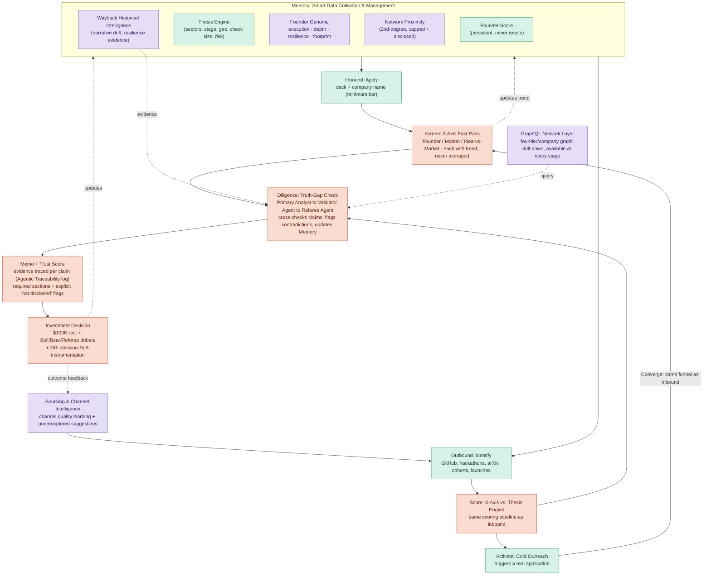

# 00 — Overview & Shared Context (READ FIRST, ALL AGENTS)

**Project:** VC Brain — Deploying $100K Checks in 24 Hours (Hack-Nation × Maschmeyer Group)
**Master PRD:** `../VC_Brain_PRD.md` (authoritative if any conflict arises)

Every build agent must read this file and `01-CONTRACTS.md` before starting. **Before coding:** complete `13-PRE-BUILD-CHECKLIST.md`. Then read only your assigned workstream file.

---

## Document Map & Agent Assignments

| File | Workstream | Suggested owner |
|---|---|---|
| `00-OVERVIEW.md` | Shared context, rules, evaluation criteria | Everyone (read-only) |
| `01-CONTRACTS.md` | Data model, REST + GraphQL contracts, conventions | Everyone (read); changes require team sign-off |
| `02-DATA-FOUNDATION.md` | Memory layer: Supabase schema, Bronze/Silver/Gold, entity resolution, Founder Score storage | Agent A — Data |
| `03-SOURCING.md` | Inbound app, outbound connectors, watchlist, cold-start, network proximity, Wayback, channel intelligence | Agent B — Sourcing |
| `04-INTELLIGENCE-TRUST.md` | 3-axis scoring, Analyst/Validator/Referee agents, Trust layer, memo generation, traceability, research tracks | Agent C — Intelligence |
| `05-CURSOR-SKILLS.md` | Thesis Engine, Perplexity research, NL queries, Cursor Skills, VC Agent Chat | Agent D — Cursor Skills |
| `06-FRONTEND-UX.md` | Investor dashboard, all UI screens | Agent E — Frontend |
| `07-EXECUTION.md` | Milestones, integration checkpoints, risks, metrics, demo checklist, optional federated module | Team lead / integrator |
| `08-IMPLEMENTATION-PLAN.md` | Time-sequenced build order with gates | Team lead / all agents |
| `09-NETWORK-GRAPH-UI.md` | Founder network graph UI (Agent E + B) | Agent E — Frontend |
| `10-FILTERING-FUNNEL.md` | How VC thesis + founder profile filter companies | Everyone |
| `11-ENTITY-MODEL.md` | Founder / company / opportunity / thesis relationships | Everyone |
| `12-THESIS-SETTINGS-UI.md` | Thesis schema, API, Settings UI | Agent D + E |
| `13-PRE-BUILD-CHECKLIST.md` | **Start here before building** — keys, gates, agent dispatch | Team lead |
| `14-SEED-DATA-SPEC.md` | Demo seed catalog — stable IDs, bias pair, contradiction | Agent A |
| `15-MOCK-FIXTURES.md` | Wave 1 frontend JSON fixtures | Agent E |
| `16-MIGRATIONS-GUIDE.md` | Ordered SQL migration files + apply steps | Agent A |
| `17-PARALLEL-WORKFLOW.md` | Branch strategy, module ownership, merge order | Team lead |
| `19-INBOUND-RERANK.md` | Perplexity inbound rerank (API + cron) | Arman |

**Dependency order:** `01-CONTRACTS` → `02-DATA-FOUNDATION` (schema live early) → everything else in parallel → `06-FRONTEND` consumes APIs as they land → `07-EXECUTION` integration.

---

## 1. What We're Building (One Paragraph)

A data- and AI-first venture operating system covering **Sourcing → Screening → Diligence → Decision**: it discovers exceptional founders before they fundraise (outbound) or lets them apply with just a deck + company name (inbound), scores every opportunity on three independent axes through a configurable fund thesis, generates evidence-backed investment memos with per-claim Trust Scores, and produces a $100K yes/no recommendation a human investor can act on within 24 hours — with a persistent, never-resetting **Founder Score** and full evidence traceability behind every conclusion.

## 2. The Three Pillars (from the brief)

1. **Sourcing** — the most important part. Surface the strongest founders *before* they fundraise. Judged on data richness and smart sourcing ideas, not polish. Go deeper here than anywhere else.
2. **Assessment & Intelligence** — reasoning layer on top of Memory. Triggered by inbound applications or by outbound signals crossing a conviction threshold. Transparent about confidence, uncertainty, and evidence.
3. **Memory** — the data foundation. Nothing discarded. Deduplicated, enriched, timestamped, source-tagged. Houses the Founder Score (persists across applications, never resets). Surfaces trend over time, not just snapshots.

## 3. Canonical Pipeline Flow

## 4. Cross-Cutting Rules (BINDING FOR ALL AGENTS)

These rules apply to every workstream. Violating them loses judge points directly.

1. **Never average the three axes.** Founder, Market, and Idea-vs-Market are computed, stored, and displayed independently, each with its own trend (improving/declining/stable). No composite number anywhere — UI, API, or memo.
2. **Trust Score is per-claim, not per-company.** Every claim links to evidence with a confidence level.
3. **Never fabricate missing data.** Missing financials/cap table/etc. are flagged explicitly ("not disclosed", "unavailable at this stage"). A memo that marks its gaps scores as MORE trustworthy.
4. **Every factual output carries an evidence locator** (`source_type`, `source_locator`, `evidence_snippet`, `confidence`) — memos, chatbot answers, axis scores, all of it.
5. **Provenance on every ingested record:** `source`, `source_entity_id`, `fetched_at`, `run_id`. Nothing enters the system anonymous.
6. **Cold-start founders are first-class.** Absence of network/GitHub/funding signal = "unknown", never "bad". There is an explicit scoring path for them (see `03-SOURCING.md` §4).
7. **Network proximity never dominates merit.** The 2nd-degree network signal is capped (~10–15% max of Founder axis), always disclosed in plain language, and primarily used for sourcing attention, not scoring.
8. **Founder Score ≠ 3-axis score.** Founder Score lives in Memory, persists across applications per person. The 3-axis score is per-opportunity. Founder Score is one input into the Founder axis.
9. **Outbound converges into the same screening funnel as inbound** — same code path, not a parallel pipeline.
10. **Out of scope — do not build:** portfolio monitoring, follow-on rounds, fund ops, exit modeling, production blockchain.

## 5. Evaluation Criteria (judge scoring — drives priorities)

| Criterion | Weight | Implication |
|---|---|---|
| Data Architecture and Intelligence | 30% | Sourcing/ingestion depth wins. Cold-start handling explicitly required. |
| Intelligent Analysis and Trust | 25% | Per-claim Trust Scores, transparent uncertainty. |
| Investment Utility & Execution | 30% | Actionable 24h recommendation + speed instrumentation. |
| User Experience and Design | 15% | Notion-approachable, Bloomberg-deep. Smallest slice — cut last-mile polish before cutting data/trust. |

**Priority rule:** Data + Trust + Utility = 85%. If time pressure hits, protect sourcing depth and trust transparency; UI polish goes last; the federated module (optional) is cut first.

## 6. Target Users
- Solo GP / early-stage VC analyst (primary persona for all UX decisions).
- Scout / accelerator operator.
- Founders applying inbound (minimal friction: deck + company name).

## 7. Tech Stack (summary — details in 01-CONTRACTS.md)
Next.js + TypeScript frontend · FastAPI backend · Supabase (Postgres + pgvector + Auth + Storage) · Databricks (Bronze/Silver/Gold) · OpenAI (agents) · Perplexity (search-grounded research) · Tavily (claim verification) · Wayback CDX API · GraphQL (Strawberry/Ariadne) · ElevenLabs (voice briefing flourish).
