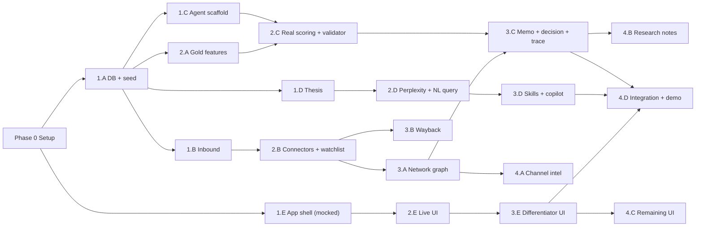

# 08 — Implementation Plan (Executable Build Order)

**Purpose:** the concrete, time-sequenced plan that turns docs 00–07 into working software. Assumes a ~24–36 hour hackathon window and multiple builders (human or AI agents) working in parallel. Times are cumulative from kickoff; compress or stretch proportionally.

**How to use with AI agents:** each task block below is written to be dispatched as a self-contained agent prompt: *"Read `docs/00-OVERVIEW.md` + `docs/01-CONTRACTS.md`, then implement task X.Y below from `docs/08-IMPLEMENTATION-PLAN.md`."* Tasks in the same wave run in parallel; waves are sequential gates.

---

## Phase 0 — Setup (Hour 0–1, ONE person, blocks everything)

### 0.1 Repo scaffold
```bash
mkdir -p apps/web apps/api shared/schemas jobs/connectors dbx db/migrations db/seed docs
cd apps/api && python3.11 -m venv .venv && source .venv/bin/activate
pip install fastapi uvicorn pydantic supabase strawberry-graphql openai httpx celery redis python-multipart pypdf tenacity
pip freeze > requirements.txt
cd ../web && npx create-next-app@latest . --typescript --tailwind --app --no-src-dir
npx shadcn@latest init
```

### 0.2 Services & keys
- Create Supabase project → note `SUPABASE_URL`, `SUPABASE_SERVICE_KEY`; enable pgvector extension; create `decks` storage bucket.
- Collect keys into root `.env` (never commit): `OPENAI_API_KEY`, `PERPLEXITY_API_KEY`, `TAVILY_API_KEY`, `ELEVENLABS_API_KEY`, Databricks workspace token (if used).
- Create Databricks workspace OR decide now to fall back to Postgres-only Bronze/Silver/Gold (schemas `bronze`, `silver`, `gold` in Supabase). **Decision deadline: end of Phase 0. When in doubt, Postgres-only — Databricks is a bonus, not a dependency.**

### 0.3 Shared schemas package
- Create `shared/schemas/models.py` with `EvidenceRef`, `AxisScore`, `ClaimTrust` (from `01-CONTRACTS.md` §2) + mirrored TypeScript types in `shared/schemas/types.ts`.

**Gate G0:** repo boots (`uvicorn` hello-world + `next dev`), Supabase reachable, `.env` complete.

---

## Wave 1 (Hour 1–6) — Foundation. 5 parallel tracks.

### 1.A Database & seed (Agent A) — CRITICAL PATH, start first
1. Write all migrations from `01-CONTRACTS.md` §1 into `db/migrations/001_core.sql` … `005_copilot.sql`. Include provenance columns everywhere, pgvector column on `evidence`/deck chunks.
2. `ingest_raw(source, payload, run_id)` + `resolve_founder(candidate_identity)` helpers in `apps/api/api/ingestion/memory.py` (deterministic rules now; LLM fuzzy match stub for Wave 2).
3. Seed data in `db/seed/seed.py`:
   - 8–12 synthetic founders: ≥2 established, ≥2 cold-start (public footprint only), 1 cold-start (network proximity only), the **bias-test pair**, 1 founder with a **seeded ARR contradiction**, 1 with a dead company domain (for Wayback).
   - ~25 network nodes/edges incl. 5+ anchor-tagged nodes; 2–3 fictional deck PDFs in `db/seed/decks/`.
4. **Output:** `make db-reset && make db-seed` works end to end.

### 1.B Inbound + screening (Agent B)
1. `POST /application/submit`: upload deck to Supabase Storage, create `opportunities` row.
2. Deck parser (`pypdf` + OpenAI structured output): slides → `claims` rows with slide-number locators.
3. Fast screen: single cheap LLM call → `pass | reject | needs-more-info` + one-line reason, stored on opportunity.
4. **Output:** curl a seed deck → claims in DB with locators + screen verdict.

### 1.C Agent pipeline scaffolding (Agent C)
1. `apps/api/api/intelligence/agents.py`: Analyst, Validator, Referee as OpenAI structured-output calls with versioned prompt constants.
2. Stub 3-axis scoring returning `AxisScore` shapes from Gold features (real features arrive Wave 2).
3. `reasoning_traces` writer utility — every agent call logs stage, input IDs, prompt version, output claim IDs.
4. **Output:** `POST /opportunity/{id}/analyze` runs the 3-agent chain on seed data and writes traces (scores may be crude).

### 1.D Thesis Engine (Agent D)
1. `POST/GET /thesis` CRUD with versioning; 2 seed thesis profiles (e.g., "pre-seed AI infra EU" and "seed devtools US").
2. Thesis-to-parameters resolver: exposes ranking weights + watchlist promotion threshold for B and memo emphasis flag for C.
3. **Output:** thesis switch changes a ranked list ordering in an API response.

### 1.E App shell (Agent E)
1. Next.js layout: sidebar nav (Pipeline / Founders / Copilot / Settings), shadcn theme.
2. Pipeline dashboard against **mocked** contract responses (checked-in JSON fixtures matching `01-CONTRACTS.md` shapes).
3. Opportunity detail skeleton: three axis cards, trust heatmap placeholder, memo section list.
4. **Output:** clickable dashboard → opportunity detail with fixture data.

**Gate G1 (Hour ~6):** one seeded founder flows DB → API → real (unmocked) dashboard card. Inbound deck upload works live.

---

## Wave 2 (Hour 6–14) — Sourcing depth + real scoring. Highest judge weight; give it the most bodies.

### 2.A Bronze/Silver/Gold + Gold features (Agent A)
1. Silver normalization jobs (founder/company/artifact/event) with dedup keys.
2. Gold founder feature vectors: `builder_velocity_90d`, `execution_consistency`, `technical_depth_proxy`, `public_footprint_depth`, `resilience_proxy`.
3. Founder Score computation v1 (weighted Gold features + confidence) → append to `founder_score_history`.
4. LLM fuzzy entity matching for ambiguous identities (with logged rationale).

### 2.B Outbound connectors + watchlist (Agent B)
1. GitHub connector (REST, no auth needed for public data; cache in Bronze): repo growth, commit consistency, release cadence for seeded + a few real public founders.
2. Second connector — Hacker News (Algolia API, easiest) or ProductHunt: launch traction signals.
3. Watchlist state machine with conviction-threshold promotion (threshold from active thesis) + `promoted_via` tags.
4. Outreach artifact generator: templated draft, evidence-linked to triggering signal.
5. **Convergence:** activated watchlist entry creates an application through the SAME `POST /application/submit` code path.
6. Cold-start scoring path: public-footprint features only, confidence-qualified output, "unknown ≠ bad" rule enforced.

### 2.C Real 3-axis scoring + trust layer (Agent C)
1. Founder axis from Gold features + Founder Score input + capped `network_embeddedness` slot (wired Wave 3).
2. Market axis (`bullish|neutral|bear`) + Idea-vs-Market axis via Analyst/Referee with Tavily/Perplexity research grounding.
3. Trust Score per claim: source reliability × corroboration × recency × validator outcome.
4. Validator v1: Tavily cross-check per claim → `claim_validations` with all four statuses. **Must catch the seeded ARR contradiction.**
5. Trend computation from axis history.

### 2.D Perplexity + NL query (Agent D)
1. Perplexity client wrapper (retry, cache, citation extraction → `EvidenceRef`s).
2. `thesis_sourcing_sweep`: active thesis → structured queries → leads into Bronze via `ingest_raw(source="perplexity")`.
3. `POST /query/natural-language`: compound query → constraint decomposition (OpenAI structured output) → ranked results with per-clause match explanations.

### 2.E Live UI on real APIs (Agent E)
1. Swap fixtures for real endpoints as they land (dashboard, opportunity detail, axis cards, screen verdicts).
2. Trust heatmap + contradiction alert banner on real claim data.
3. Inbound application form page (public-facing, deck + name only).

**Gate G2 (Hour ~14):** an outbound-discovered founder AND an inbound deck both reach screening through one code path; 3 real axis scores with trends render in UI; validator catches the seeded contradiction.

---

## Wave 3 (Hour 14–22) — Trust, network, memos, copilot.

### 3.A Network graph + proximity (Agent B)
1. Populate `network_nodes`/`network_edges` from connectors + seed; tag anchors.
2. 2nd-degree traversal → `network_proximity_scores` (path_count, path_diversity, edge_recency, edge_type_strength).
3. GraphQL resolvers (Strawberry): `TopFounders`, `FounderNetwork`, `CompanyHistory`, `ChannelQuality`, `NetworkProximity` (with mandatory `disclosure` string).
4. Wire capped proximity sub-signal into C's Founder axis (≤15%, separate line item).

### 3.B Wayback module (Agent B, second half)
1. CDX index fetch for seeded dead-company domain; select 4–6 representative snapshots; cache raw HTML in Bronze.
2. LLM extraction: historical positioning/claims + sentiment → `wayback_snapshots`, `wayback_sentiment_timeseries`; narrative label (`stable|pivoted|inconsistent`).
3. Feed archived-vs-current claim contradictions into the validator.

### 3.C Memo + decision + traceability (Agent C)
1. `generate_memo`: 5 required sections + optional sections with explicit `not_disclosed` flags; structured JSON in `memos`; every claim carries Trust Score + `EvidenceRef`.
2. Decision output: $100K yes/no + confidence + key unknowns + Bull/Bear summary → `decision_log` with stage timestamps (SLA instrumentation).
3. `GET /recommendation/{id}/trace` serving the full reasoning-trace drill-down.
4. **Bias test executed as a scripted check:** execution-strong/network-zero founder must outrank network-strong/execution-weak on the Founder axis. Fix weights until it passes.

### 3.D Skill repository + copilot (Agent D)
1. `skill_definitions` + `skill_runs` infra; register all 10 skills as thin adapters over B/C services (catalog in `05-COPILOT-SKILLS.md` §4).
2. Router agent (`POST /copilot/message`): OpenAI tool-calling over the skill catalog; explicit "no matching skill" response; skill chaining within a turn.
3. `POST /skill-runs/{id}/rerun` + diff computation vs. prior run.

### 3.E Differentiator UI (Agent E)
1. Founder profile: Genome radar (5 dimensions) + Founder Score trend + **separate** network badge with disclosure text + click-through path view.
2. Evidence drill-down (claim → source, ≤2 clicks) + "Why this recommendation?" trace view.
3. Memo view with visible gap-flag badges; copilot chat panel (skills + citations + re-run diff).
4. Decision SLA timer from `decision_log` timestamps.

**Gate G3 (Hour ~22):** trace drill-down works; memo renders with gap flags; copilot answers a free-form question with citations; bias test passes; Wayback timeline renders.

---

## Wave 4 (Hour 22–30) — Close the loop, polish, dry run.

### 4.A Channel intelligence (Agent B)
- Channel quality scores from `DISCOVERED_VIA` + decision outcomes; exploration bonus; `GET /channels/quality` + UI ranking with one underexplored suggestion.

### 4.B Research deliverables (Agent C)
- Confidence intervals (bootstrap over Gold features) → `founder_confidence_intervals` + `GET /research/confidence/{id}`.
- One-page **Confidence Method Note** (assumptions, features, method, failure modes).
- Data-quality thresholds note (with Agent A).

### 4.C Remaining UI (Agent E)
- Network graph explorer (GraphQL), NL query bar, thesis settings with live re-ranking, "why not?" rejection views.
- ElevenLabs voice briefing button (if time).

### 4.D Integration + demo (Team lead)
1. Full demo dry run against `07-EXECUTION.md` §8 checklist — timed, twice.
2. Record fallback demo video in case of live failure.
3. Deploy: Vercel (web) + Railway/Render (api). Verify seeded state on the deployed instance.
4. **Optional, only if everything above is green:** federated module (`07-EXECUTION.md` §3).

**Gate G4:** demo script runs end-to-end in under 5 minutes without manual DB intervention.

---

## Standing Rules During the Build

- **Cut order when behind:** federated module → ElevenLabs → network graph explorer UI → channel intelligence UI → second research note. NEVER cut: outbound sourcing, cold-start path, validator, per-claim trust, memo gap flags, SLA timer.
- **Every merged feature must respect the 10 binding rules** in `00-OVERVIEW.md` §4 — reviewer checks them on every PR.
- **External API discipline:** all GitHub/Perplexity/Tavily/Wayback calls cached in Bronze; reruns hit cache. Rate-limit failures degrade gracefully, never crash the pipeline.
- **Fixtures stay in sync:** if a contract shape changes (team sign-off required), update `shared/schemas` + frontend fixtures in the same PR.
- **Commit cadence:** small commits per task ID (e.g., `2.B watchlist promotion`), main always demoable after each gate.

## Dependency Graph (summary)


